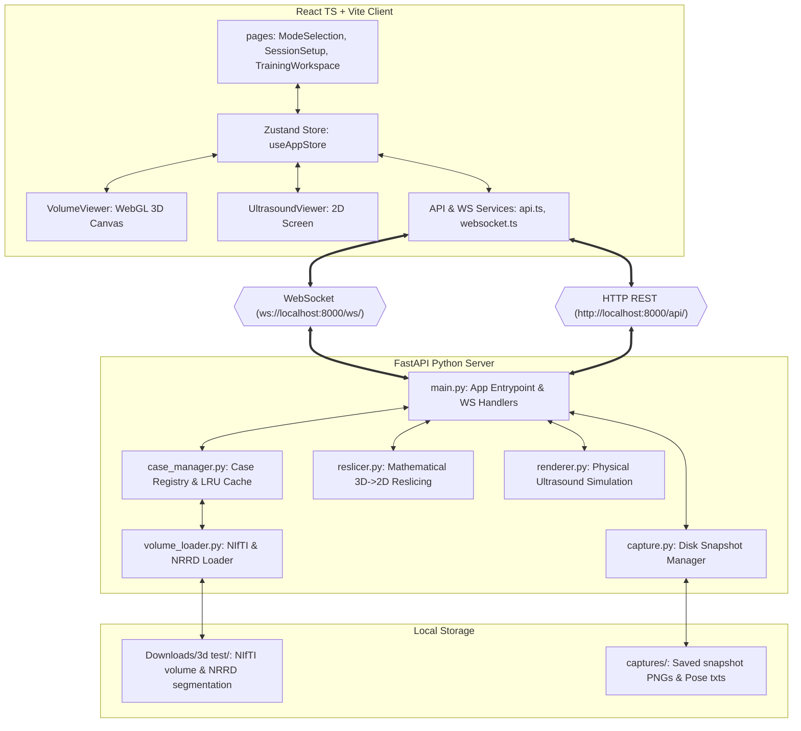

# AI-Guided Ultrasound Simulator: System Architecture & Structure

This document provides a detailed breakdown of the **AI-Guided Ultrasound Training System** structure, explaining how the components interact to deliver a real-time, low-latency ultrasound simulation directly in the browser without requiring 3D Slicer or heavy desktop applications.

---

## 1. High-Level Architecture Overview

The system follows a classic client-server split optimized for real-time visualization:



---

## 2. Real-Time Ultrasound Simulation Flow

When a trainee moves the virtual ultrasound probe on the 3D model:

1. **Pose Acquisition**: The frontend captures the probe's position ($x, y, z$) and rotation ($\text{pitch}, \text{yaw}, \text{roll}$) relative to the torso's 3D mesh.
2. **WebSocket Pipeline**:
   - The frontend serializes the pose as a WebSocket packet: `{"type": "probeUpdate", "data": { "x", "y", "z", "pitch", "yaw", "roll", "pressure", "contactQuality", ... }}`.
   - The backend's WebSocket connection handler in [main.py](file:///Users/ahmedbahaa/Documents/Ai_Ultrasound_final/ai_guided_ultrasound/backend/main.py) receives the message.
3. **Reslicing**:
   - [reslicer.py](file:///Users/ahmedbahaa/Documents/Ai_Ultrasound_final/ai_guided_ultrasound/backend/reslicer.py) takes the coordinate matrix and extracts a 2D slice from the cached 3D NIfTI volume using trilinear/bilinear interpolation.
   - If segmentations are enabled, it also extracts a matching 2D slice from the NRRD segmentation.
4. **Acoustic Simulation Rendering**:
   - [renderer.py](file:///Users/ahmedbahaa/Documents/Ai_Ultrasound_final/ai_guided_ultrasound/backend/renderer.py) post-processes the 2D slices to emulate ultrasound physics:
     - **Speckle Noise**: Applies Rayleigh/Gaussian noise to simulate ultrasound interference.
     - **Attenuation**: Darkens the signal deeper in the tissue.
     - **Logarithmic Compression**: Re-maps high dynamic range CT values to soft-tissue contrast.
     - **Probe Masking**: Masks the rectangular slice into a curvilinear/linear scan sector.
     - **Overlay Blending**: Merges the anatomical segmentations (e.g. liver, kidney) into the frame if requested.
5. **Frame Transmission**: The rendered frame is compressed as a Base64-encoded PNG and sent back over the WebSocket: `{"type": "ultrasoundFrame", "data": { "image": "data:image/png;base64,...", "timestamp": 1234567 }}`.

---

## 3. Directory & File Breakdown

### 📁 Project Root
* **[package.json](file:///Users/ahmedbahaa/Documents/Ai_Ultrasound_final/ai_guided_ultrasound/package.json)**: Node dependencies including Vite, React, TailwindCSS (if configured), Three.js, Lucide icons, and state managers.
* **[tsconfig.json](file:///Users/ahmedbahaa/Documents/Ai_Ultrasound_final/ai_guided_ultrasound/tsconfig.json)**: Configures typescript compile checks.
* **[USTrainingModule.py](file:///Users/ahmedbahaa/Documents/Ai_Ultrasound_final/ai_guided_ultrasound/USTrainingModule.py)**: Legacy scripted 3D Slicer module, used as a reference during system porting.
* **[validate_dataset.py](file:///Users/ahmedbahaa/Documents/Ai_Ultrasound_final/ai_guided_ultrasound/validate_dataset.py)**: Audits case folder consistency.

---

### 📁 Backend (`ai_guided_ultrasound/backend/`)

The Python backend is powered by FastAPI, NumPy, SciPy, Nibabel, and Uvicorn.

* **[main.py](file:///Users/ahmedbahaa/Documents/Ai_Ultrasound_final/ai_guided_ultrasound/backend/main.py)**: 
  * Configures the FastAPI server.
  * Manages active simulated sessions.
  * Hosts WebSocket endpoints (`/ws/{session_id}`) and HTTP endpoints (`/api/cases`, `/api/session/create`, `/api/capture`, etc.).
* **[case_manager.py](file:///Users/ahmedbahaa/Documents/Ai_Ultrasound_final/ai_guided_ultrasound/backend/case_manager.py)**:
  * Scans files inside the dataset root directory (e.g., `Downloads/3d test`).
  * Discovers folders containing `.nii.gz` volumes and `.seg.nrrd` files.
  * Holds an in-memory Least Recently Used (LRU) Cache (`CACHE_SIZE = 3`) to keep active volumetric data in memory without causing server Out-of-Memory (OOM) errors.
* **[volume_loader.py](file:///Users/ahmedbahaa/Documents/Ai_Ultrasound_final/ai_guided_ultrasound/backend/volume_loader.py)**:
  * Uses `nibabel` to read NIfTI voxel arrays and extract spacing/affine matrices.
  * Uses `pynrrd` to load multi-label anatomical segmentation masks.
* **[reslicer.py](file:///Users/ahmedbahaa/Documents/Ai_Ultrasound_final/ai_guided_ultrasound/backend/reslicer.py)**:
  * Transforms the virtual probe's world coordinate matrix into voxel coordinates.
  * Performs coordinate mapping and interpolation to extract 2D cross-sections.
* **[renderer.py](file:///Users/ahmedbahaa/Documents/Ai_Ultrasound_final/ai_guided_ultrasound/backend/renderer.py)**:
  * Simulates acoustic attenuation, speckle noise, gain, and dynamic range mapping.
  * Masks image bounds to look like linear or curvilinear probe outputs.
* **[probe_controller.py](file:///Users/ahmedbahaa/Documents/Ai_Ultrasound_final/ai_guided_ultrasound/backend/probe_controller.py)**:
  * Contains probe models and pose-to-matrix math.
* **[capture.py](file:///Users/ahmedbahaa/Documents/Ai_Ultrasound_final/ai_guided_ultrasound/backend/capture.py)**:
  * Writes snapshots and matching 4x4 transform matrices to the local disk.

---

### 📁 Frontend (`ai_guided_ultrasound/src/`)

Built with React 18, TypeScript, and Three.js (for the 3D anatomical viewer).

#### 📁 `pages/`
* **[ModeSelection.tsx](file:///Users/ahmedbahaa/Documents/Ai_Ultrasound_final/ai_guided_ultrasound/src/pages/ModeSelection.tsx)**: Portal for choosing learning modes (Full Training, Identification, Registration, Assessment).
* **[SessionSetup.tsx](file:///Users/ahmedbahaa/Documents/Ai_Ultrasound_final/ai_guided_ultrasound/src/pages/SessionSetup.tsx)**: Selects a case, probe type (curvilinear vs. linear), abdominal targets, and difficulty.
* **[TrainingWorkspace.tsx](file:///Users/ahmedbahaa/Documents/Ai_Ultrasound_final/ai_guided_ultrasound/src/pages/TrainingWorkspace.tsx)**: Entry route that loads and routes active training layouts.
* **[SystemStatus.tsx](file:///Users/ahmedbahaa/Documents/Ai_Ultrasound_final/ai_guided_ultrasound/src/pages/SystemStatus.tsx)**: Diagnostics page showing backend connectivity and dataset validity.

#### 📁 `components/workspace/`
* **[VolumeViewer.tsx](file:///Users/ahmedbahaa/Documents/Ai_Ultrasound_final/ai_guided_ultrasound/src/components/workspace/VolumeViewer.tsx)**:
  * Configures the **Three.js** canvas.
  * Loads the 3D torso mesh model (`fat_male_torso.glb`).
  * Visualizes the slice plane's position inside the torso in real time.
* **[UltrasoundViewer.tsx](file:///Users/ahmedbahaa/Documents/Ai_Ultrasound_final/ai_guided_ultrasound/src/components/workspace/UltrasoundViewer.tsx)**:
  * Displays the 2D simulated ultrasound image returned by the backend.
  * Adds interactive overlays (measuring caliper calipers, HUD grid, and labels).
* **[Volume35SimulatorLayout.tsx](file:///Users/ahmedbahaa/Documents/Ai_Ultrasound_final/ai_guided_ultrasound/src/components/workspace/Volume35SimulatorLayout.tsx)**:
  * Handles custom coordinate alignments and configurations for specific volumetric sets.
* **[PressureVisualization.tsx](file:///Users/ahmedbahaa/Documents/Ai_Ultrasound_final/ai_guided_ultrasound/src/components/workspace/PressureVisualization.tsx)**:
  * Displays probe-to-skin pressure feedback metrics.

#### 📁 `store/`
* **[useAppStore.ts](file:///Users/ahmedbahaa/Documents/Ai_Ultrasound_final/ai_guided_ultrasound/src/store/useAppStore.ts)**:
  * The global Zustand state hub.
  * Syncs session parameters, active case data, probe coordinate updates, connection state, captures, and calibration options.

#### 📁 `services/`
* **[api.ts](file:///Users/ahmedbahaa/Documents/Ai_Ultrasound_final/ai_guided_ultrasound/src/services/api.ts)**: Handles HTTP requests to the FastAPI backend (e.g. creating sessions, fetching captures).
* **[websocket.ts](file:///Users/ahmedbahaa/Documents/Ai_Ultrasound_final/ai_guided_ultrasound/src/services/websocket.ts)**: Manages WebSocket connection lifecycle, queueing messages if temporarily disconnected, and deserializing frames.

---

## 4. Communication Protocols

### 📡 WebSocket Protocol (Client ↔ Server)

The real-time connection runs on `ws://localhost:8000/ws/{session_id}`.

#### 📤 Client Upstream Packets

1. **Probe Pose Update** (`probeUpdate`):
   ```json
   {
     "type": "probeUpdate",
     "data": {
       "x": -24.5,
       "y": -12.2,
       "z": 150.3,
       "pitch": 5.0,
       "yaw": 0.0,
       "roll": -15.0,
       "pressure": 0.45,
       "contactQuality": 98.0,
       "probeType": "curvilinear"
     }
   }
   ```
2. **Settings Change** (`settingsUpdate`):
   ```json
   {
     "type": "settingsUpdate",
     "data": {
       "wl": 60.0,
       "ww": 360.0,
       "showSeg": true,
       "planeSizeMm": 150.0,
       "resolution": 512
     }
   }
   ```
3. **Snapshot Trigger** (`capture`):
   ```json
   {
     "type": "capture"
   }
   ```

#### 📥 Server Downstream Packets

1. **Simulated Ultrasound Frame** (`ultrasoundFrame`):
   ```json
   {
     "type": "ultrasoundFrame",
     "data": {
       "image": "data:image/png;base64,iVBORw0KGgoAAA...",
       "timestamp": 1782390192.48
     }
   }
   ```
2. **Capture Result** (`captureResult`):
   ```json
   {
     "type": "captureResult",
     "data": {
       "success": true,
       "frame_index": 4,
       "image_path": "captures/...png",
       "matrix_path": "captures/...txt"
     }
   }
   ```

---

## 5. Dataset Structure (Local Disk)

For cases to be loaded and run successfully, they are scanned from the following structure under `~/Downloads/3d test/`:

```
Downloads/3d test/
├── test3/
│   ├── 4 Unnamed Series_2.nii.gz                   <-- Volume (Required)
│   └── 4 Unnamed Series_2 segmentation.seg.nrrd   <-- Segmentation Labels
├── test11/
│   ├── 7 Unnamed Series_1.nii.gz
│   ├── 7 Unnamed Series_1 segmentation-label.nii.gz
│   └── 7 Unnamed Series_1 segmentation.seg.nrrd
└── ...
```

> [!NOTE]
> The backend validates cases dynamically. If a case folder has no `.nii.gz` file (or only metadata like `.mrml` or `.png`), it is marked as invalid with the warning `Missing CT volume (.nii.gz)`.
